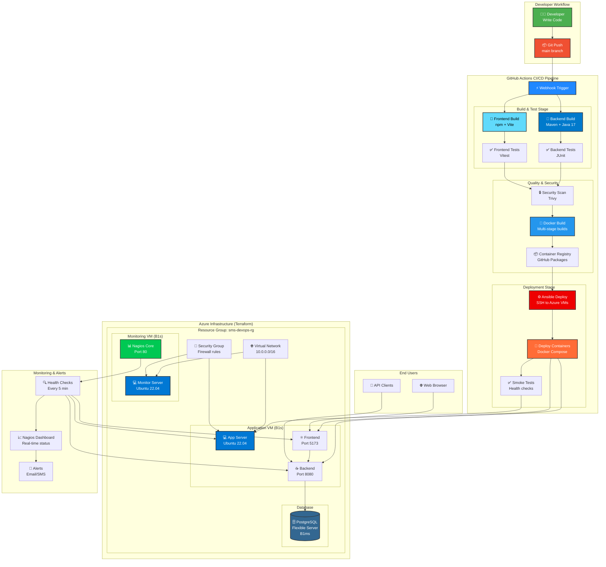

# SMS DevOps Architecture Diagram

## Pipeline Flow

### 1️⃣ Development Phase
- Developer writes code locally
- Commits and pushes to GitHub main branch

### 2️⃣ CI Phase (Continuous Integration)
- **Backend Build**: Maven compiles Java 17 code
- **Frontend Build**: npm builds React TypeScript app
- **Testing**: JUnit & Vitest run all tests
- **Security Scan**: Trivy checks for vulnerabilities

### 3️⃣ CD Phase (Continuous Deployment)
- **Docker Build**: Creates optimized container images
- **Registry Push**: Publishes to GitHub Container Registry
- **Ansible Deploy**: Connects to Azure VMs via SSH
- **Container Deploy**: Runs docker-compose with new images
- **Smoke Tests**: Verifies deployment success

### 4️⃣ Infrastructure (Azure)
- **Virtual Network**: Isolated network (10.0.0.0/16)
- **Security Groups**: Firewall rules (SSH, HTTP, 8080, 5173)
- **App VM**: Runs backend + frontend containers
- **Monitor VM**: Runs Nagios monitoring
- **PostgreSQL**: Managed database service

### 5️⃣ Monitoring
- **Nagios Core**: Checks services every 5 minutes
- **Health Checks**: PING, SSH, HTTP, CPU, Disk
- **Dashboard**: Real-time status visualization
- **Alerts**: Notifications on failures

### 6️⃣ User Access
- **Frontend**: http://APP_VM_IP:5173
- **Backend API**: http://APP_VM_IP:8080
- **Swagger**: http://APP_VM_IP:8080/swagger-ui
- **Nagios**: http://MONITOR_VM_IP/nagios

---

## Component Details

### Azure Resources (Free Tier)
| Resource | Size | Cost/Month | Purpose |
|----------|------|------------|---------|
| App VM | B1s (1 vCPU, 1GB) | Free* | Run application |
| Monitor VM | B1s (1 vCPU, 1GB) | Free* | Run Nagios |
| PostgreSQL | B1ms | ~$12 | Database |
| Networking | Standard | Free | VNet, NSG, IPs |

*750 hours/month free with Azure Student

### Container Architecture
```
App VM:
├── Backend Container (Port 8080)
│   ├── Spring Boot 3.2.5
│   ├── Java 17 JRE
│   └── Connects to PostgreSQL
│
└── Frontend Container (Port 5173)
    ├── Nginx Alpine
    ├── React Production Build
    └── Proxies to Backend

Monitor VM:
└── Nagios Core
    ├── Apache Web Server
    ├── Nagios Service Checks
    └── Monitoring Dashboard
```

### CI/CD Pipeline Timing
- Backend Build: ~3 minutes
- Frontend Build: ~2 minutes
- Docker Build: ~2 minutes
- Security Scan: ~1 minute
- Deployment: ~2 minutes
- **Total: ~10 minutes** (from push to production)

### Monitoring Checks
| Check | Interval | Warning | Critical |
|-------|----------|---------|----------|
| PING | 5 min | 100ms, 20% loss | 500ms, 60% loss |
| Backend API | 5 min | - | No HTTP 200 |
| Frontend | 5 min | - | Port closed |
| CPU Load | 5 min | >4.0 | >6.0 |
| Disk Usage | 5 min | >80% | >90% |

---

## Technology Stack Summary

### Application Layer
- **Backend**: Spring Boot 3.2.5, Spring Security 6, JWT, JPA
- **Frontend**: React 18, TypeScript, Vite, Tailwind CSS
- **Database**: PostgreSQL 15

### DevOps Layer
- **IaC**: Terraform 1.0+
- **Config Mgmt**: Ansible 2.9+
- **CI/CD**: GitHub Actions
- **Containers**: Docker, Docker Compose
- **Monitoring**: Nagios Core 4.4.14
- **Cloud**: Microsoft Azure

### Build Tools
- **Backend**: Maven 3.9+
- **Frontend**: npm, Vite
- **Testing**: JUnit 5, Vitest
- **Security**: Trivy

---

## Data Flow

### User Request Flow
```
User Browser
    ↓ (HTTP)
Frontend Container (Port 5173)
    ↓ (REST API)
Backend Container (Port 8080)
    ↓ (JDBC)
PostgreSQL Database (Port 5432)
    ↓ (Response)
Backend → Frontend → User
```

### Monitoring Flow
```
Nagios Server
    ↓ (check_http)
Backend API (/health)
    ↓ (Status: OK/CRITICAL)
Nagios Dashboard
    ↓ (Alerts if CRITICAL)
Email/SMS Notification
```

### Deployment Flow
```
GitHub Push
    ↓ (Webhook)
GitHub Actions Runner
    ↓ (Ansible SSH)
Azure App VM
    ↓ (Docker Compose)
Pull Images → Start Containers
    ↓ (Health Check)
Smoke Tests → Success/Fail
```

---

## Network Architecture

### Security Groups (Firewall Rules)
```
Inbound Rules:
├── SSH (22)        → From Anywhere (for admin)
├── HTTP (80)       → From Anywhere (Nagios)
├── Backend (8080)  → From Anywhere (API)
└── Frontend (5173) → From Anywhere (Web UI)

Outbound Rules:
└── All traffic allowed (for updates, Docker pulls)
```

### Private Network (VNet)
```
10.0.0.0/16
    └── Subnet: 10.0.1.0/24
        ├── App VM: 10.0.1.4 (dynamic)
        ├── Monitor VM: 10.0.1.5 (dynamic)
        └── Gateway: 10.0.1.1
```

---

This architecture demonstrates:
✅ Scalable microservices design
✅ Automated CI/CD pipeline
✅ Infrastructure as Code
✅ Comprehensive monitoring
✅ Security best practices
✅ Cost optimization (free tier)
✅ Production-ready DevOps workflow
