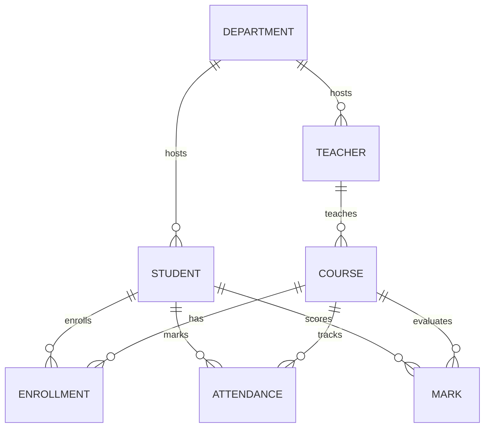

# Student Management System (SMS)

Apple-inspired full-stack SMS with Spring Boot 3 + React/Vite.

## 🚀 NEW: Complete DevOps Implementation!

This project now includes a **production-grade DevOps pipeline** with:
- ✅ **Terraform** - Infrastructure as Code (Azure)
- ✅ **Ansible** - Automated server configuration
- ✅ **GitHub Actions** - Full CI/CD pipeline
- ✅ **Docker** - Containerized deployment
- ✅ **Nagios** - 24/7 monitoring & alerts

### 📚 DevOps Documentation
- **[🎯 Quick Start (30 min setup)](QUICKSTART.md)** - Fast deployment guide
- **[📖 Complete DevOps Guide](README-DEVOPS.md)** - Detailed technical documentation
- **[🎓 Presentation Guide](PRESENTATION-GUIDE.md)** - How to demo in class
- **[🏗️ Architecture Diagram](ARCHITECTURE.md)** - System design & data flow
- **[🔐 GitHub Secrets Setup](GITHUB-SECRETS-GUIDE.md)** - CI/CD configuration
- **[📋 Project Summary](DEVOPS-SUMMARY.md)** - What was built & why

**Time to deploy:** ~30 minutes | **Cost:** Free (Azure Student) | **Difficulty:** Intermediate

---

## Features
- JWT auth (Admin, Teacher, Student) with Spring Security 6, role-guarded routes.
- CRUD for Students, Teachers, Courses, Departments, Enrollments, Attendance, Marks.
- CSV bulk upload & validation for students.
- Admin dashboard with live metrics, search/filter/sort tables, dark/light toggle, responsive layout.
- Swagger/OpenAPI, Postman collection, SQL + CSV seed data, Dockerized stack.

## Architecture
```
[React/Vite/Tailwind/Framer Motion] ⇄ [Spring Boot REST API] ⇄ [H2 dev / Postgres prod]
```

### ER Diagram


## Requirements
- Java 17, Maven 3.9+
- Node 18+, pnpm/npm/yarn
- Docker (for containers)

## Backend
```
cd backend
mvn spring-boot:run
```
Swagger UI: `http://localhost:8080/swagger-ui/index.html`

### Env vars
See `.env.example`. Critical:
- `SPRING_PROFILES_ACTIVE`
- `SPRING_DATASOURCE_URL`, `SPRING_DATASOURCE_USERNAME`, `SPRING_DATASOURCE_PASSWORD`
- `JWT_SECRET`, `JWT_EXPIRATION_MS`

## Frontend
```
cd frontend
npm install
npm run dev
```
Vite dev server defaults to `http://localhost:5173`.

## Docker Compose
```
docker-compose up --build
```
Brings up Postgres, backend (profile=prod), frontend.

## Testing
```
cd backend && mvn test
cd frontend && npm run test
```

## Postman / Curl
Import `postman/SMS.postman_collection.json` or use curl samples at the end of this document.

## CSV Format
`students_sample.csv` demonstrates required columns:
```
rollNo,firstName,lastName,email,phone,dob,gender,address,departmentCode,enrollDate,profilePhotoUrl,status
```

## Seed Data
- `scripts/seed.sql`
- `backend/src/main/resources/db/data.sql`
- `scripts/students_sample.csv`

## Sample Flow
1. Register admin -> login -> grab JWT.
2. Create departments, teachers, courses.
3. Bulk upload or create students.
4. Enroll students, mark attendance, record marks.
5. Explore dashboard analytics from admin UI.

## Troubleshooting
- Enable H2 console at `/h2-console` (dev profile).
- Logs: `logs/` or console (Spring Boot default).
- Ensure `JWT_SECRET` is at least 32 chars.

## License
MIT (adjust as needed).

---

## 🎓 DevOps Classroom Project

This application demonstrates modern DevOps practices suitable for academic presentations:

### What's Included:
- **Infrastructure as Code**: Terraform creates 2 Azure VMs, PostgreSQL, networking
- **Configuration Management**: Ansible automates server setup (Docker, Java, Node.js)
- **CI/CD Pipeline**: GitHub Actions builds, tests, scans, and deploys automatically
- **Containerization**: Multi-stage Docker builds for backend and frontend
- **Monitoring**: Nagios tracks application health, CPU, disk, and services
- **Security**: Automated vulnerability scanning with Trivy

### Quick Commands:
```powershell
# Generate SSH keys
.\scripts\generate-ssh-key.ps1

# Deploy infrastructure to Azure
.\scripts\deploy-azure.ps1

# Configure servers (in WSL)
.\scripts\configure-servers.sh

# Push code to auto-deploy
git push origin main
```

### Access Points (after deployment):
- **Backend API**: http://YOUR_VM_IP:8080
- **Frontend**: http://YOUR_VM_IP:5173
- **Swagger**: http://YOUR_VM_IP:8080/swagger-ui/index.html
- **Nagios**: http://YOUR_MONITOR_IP/nagios

### Skills Demonstrated:
Azure • Terraform • Ansible • Docker • GitHub Actions • Nagios • Linux • Spring Boot • React • PostgreSQL • CI/CD • IaC • Configuration Management • Monitoring • Security Scanning

**Perfect for:** Class projects, portfolio pieces, DevOps learning, cloud deployment practice

**See [QUICKSTART.md](QUICKSTART.md) for 30-minute setup guide!**

---
