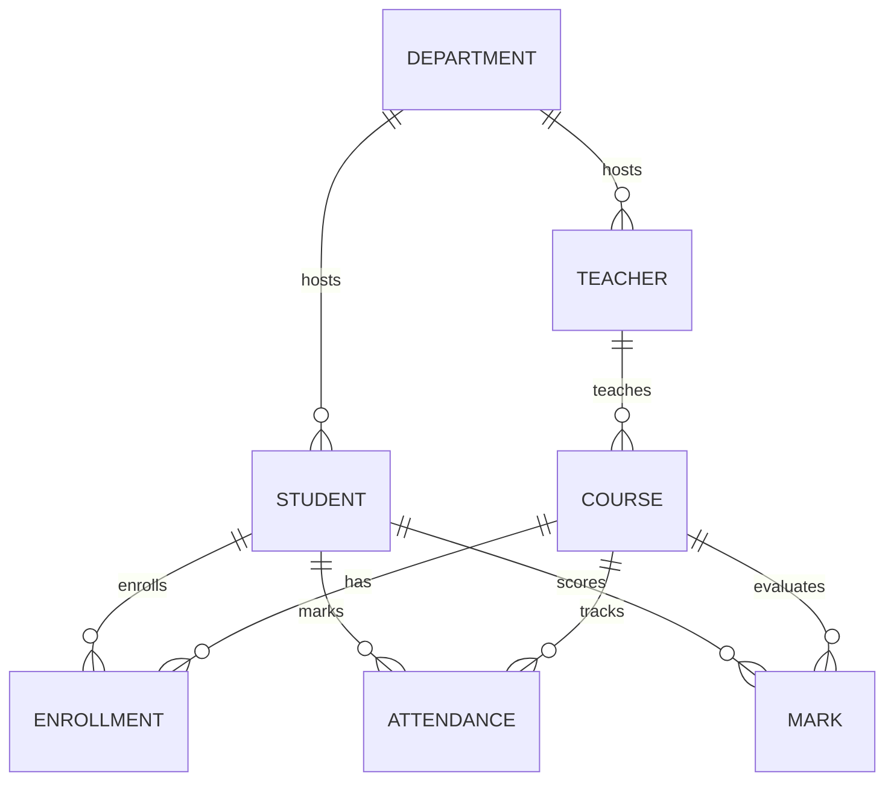

# Student Management System (SMS)

Apple-inspired full-stack SMS with Spring Boot 3 + React/Vite.

## Features
- JWT auth (Admin, Teacher, Student) with Spring Security 6, role-guarded routes.
- CRUD for Students, Teachers, Courses, Departments, Enrollments, Attendance, Marks.
- CSV bulk upload & validation for students.
- Admin dashboard with live metrics, search/filter/sort tables, dark/light toggle, responsive layout.
- Swagger/OpenAPI, Postman collection, SQL + CSV seed data, Dockerized stack.

## Architecture
```
[React/Vite/Tailwind/Framer Motion] ⇄ [Spring Boot REST API] ⇄ [H2 dev / Postgres prod]
```

### ER Diagram


## Requirements
- Java 17, Maven 3.9+
- Node 18+, pnpm/npm/yarn
- Docker (for containers)

## Backend
```
cd backend
mvn spring-boot:run
```
Swagger UI: `http://localhost:8080/swagger-ui/index.html`

### Env vars
See `.env.example`. Critical:
- `SPRING_PROFILES_ACTIVE`
- `SPRING_DATASOURCE_URL`, `SPRING_DATASOURCE_USERNAME`, `SPRING_DATASOURCE_PASSWORD`
- `JWT_SECRET`, `JWT_EXPIRATION_MS`

## Frontend
```
cd frontend
npm install
npm run dev
```
Vite dev server defaults to `http://localhost:5173`.

## Docker Compose
```
docker-compose up --build
```
Brings up Postgres, backend (profile=prod), frontend.

## Testing
```
cd backend && mvn test
cd frontend && npm run test
```

## Postman / Curl
Import `postman/SMS.postman_collection.json` or use curl samples at the end of this document.

## CSV Format
`students_sample.csv` demonstrates required columns:
```
rollNo,firstName,lastName,email,phone,dob,gender,address,departmentCode,enrollDate,profilePhotoUrl,status
```

## Seed Data
- `scripts/seed.sql`
- `backend/src/main/resources/db/data.sql`
- `scripts/students_sample.csv`

## Sample Flow
1. Register admin -> login -> grab JWT.
2. Create departments, teachers, courses.
3. Bulk upload or create students.
4. Enroll students, mark attendance, record marks.
5. Explore dashboard analytics from admin UI.

## Troubleshooting
- Enable H2 console at `/h2-console` (dev profile).
- Logs: `logs/` or console (Spring Boot default).
- Ensure `JWT_SECRET` is at least 32 chars.

## License
MIT (adjust as needed).
